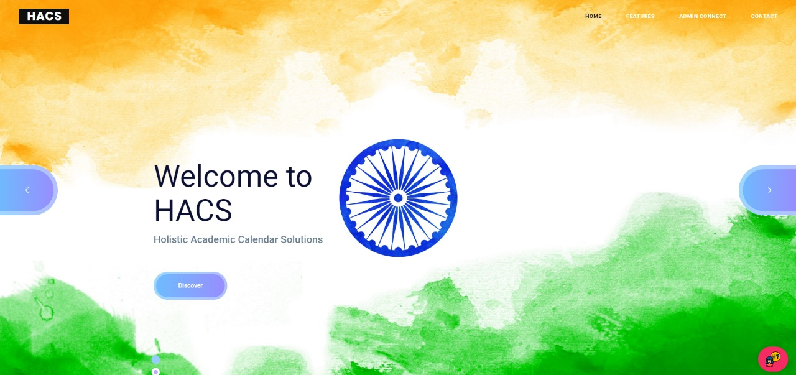
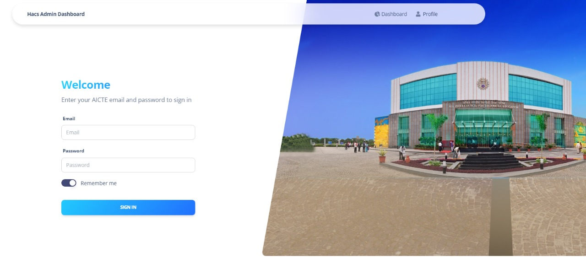
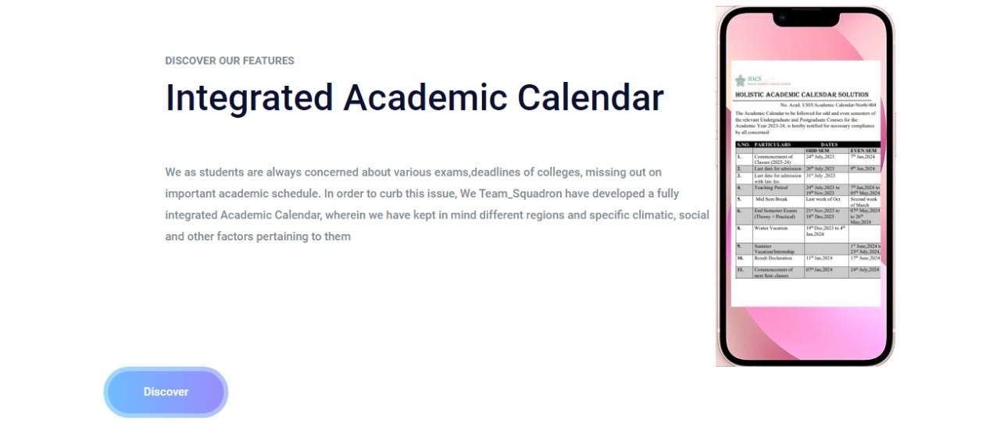

## <B>Smart India Hackathon 2022</B>

## TEAM_SQUADRON

 
 

## This is the website that is based on integration of academic calendars
 

## Solution 

 

## Integration of Academic Calendar of all Indian Universities
 

## Each University is provided academic calendar to fill mandatory details in buffer and other college events.
 

## College Prediction System
 

## Predicts colleges based on students holistic details and preferences, helps students to gather information about the colleges which saves time and money wasted in travel

[][website]
 

## Every University should have the same timeline/buffer under Facilitating course admission and shifts.
 
 

[][website]
 

## Aicte admin can add/detail university by providing them username and password so that they can login and fill up their respective academic calendar.
 
 

[][website]
 

## Student as well as faculty can view  academic calendar of their university  based on their interest.
 
 

[][website]

