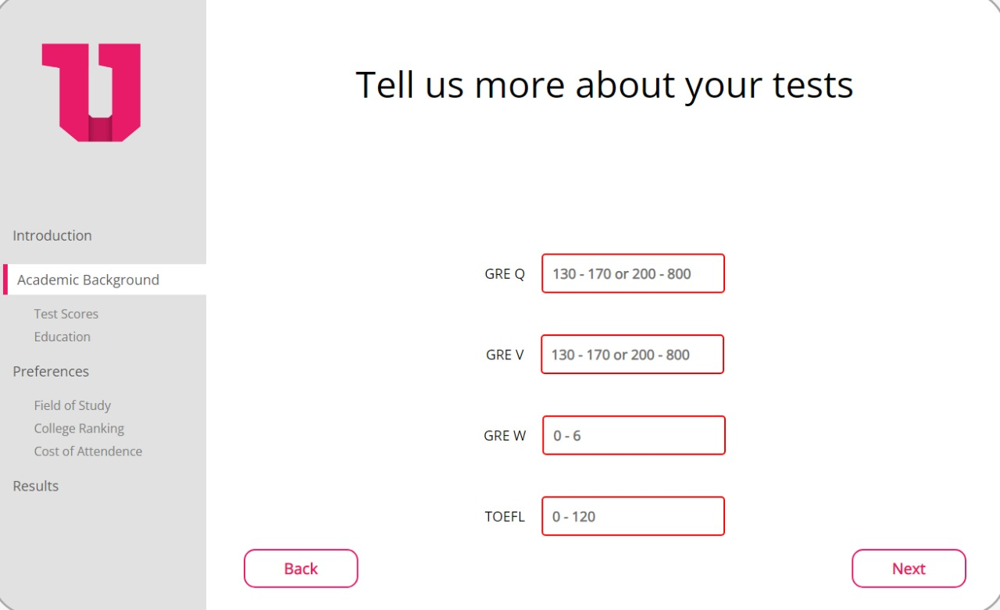

<!-- # SMART INDIA HACKATHON 2022 - TEAM_SQUADRON  -->

<h1 align="center">
	 
	SMART INDIA HACKATHON 2022

</h1>
<h1 align="center">Team_Squadron</h1>
 
</h1>
<h4 align="center">We empathise to empower - realising the dream of Aatmanirbhar Bharat</h4>

## Problem Statement

**Ministry/Organization Name** - <a href="https://www.aicte-india.org/">AICTE</a>  

**Problem Statement** - An integrated annual academic
calendar for all the Indian universities

## Understanding The Problem Statement

- **Fewer options of
courses and colleges
available**
Students of those
Institutions who complete
their examinations and
get results early have the
opportunity to select the
course of their choice and
move to the University of
choice while those whose
results are declared late
have no (Or) less options
of courses and colleges
available for them

- **Huge cost and loss of
time to students in
their academic career**
Students also have to
travel to each of these
colleges to get
information, apply and get
admitted and so on. This
results in huge cost and
loss of time to students
in their academic career.

<h5 align="center">
	 
	
Prediction model integrated on HACS(Holistic Academic Calendar Solution)

</h5>
<h5 align="center">
	 
	
HACS ADMIN

</h5>
<h5 align="center">
	 
	
ADDITIONAL FEATURES

</h5>

## Solution

We will be creating a **Landing page** which will *distribute our audience* and it will lead to *different sections specific to a disability*. We have identified and worked for some of the common disabilities possible in a person **to make their Web experience more accessible, smoother and easier.**

### **1. Institutional Admin :
- *Option for creating a university record is available*. 
- Real *smooth UI/UX* for the people 
- *Speech* to Command facility for the website traversal

### **2. Speech to Command :** 
- *Speech* to Command for easier website traversal.

- *Speech synthesis* for narrating the content present throughout the website.

### **3. Speech impaired/Hearing Impaired :**

- *Sign language keyboard* for sending and receiving messages [WIP}
- *Sign language instruction / illustration* helping in traversal of the Website.
- *Communication with Government Officials.* 

### **4. Prediction Model :**
- *AI Chatbot based on NLP *Dialogflow*.
- *Sequencial reminder* of the main purpose of visit of end-user.
- *Visual Imagery* for easier selection and traversal through website
- An extremely simple and *easy to use* website for *easier synchronization with the brain.*                               

<h3 align="center">Made With :heart:, by Team Squadron</h3>

